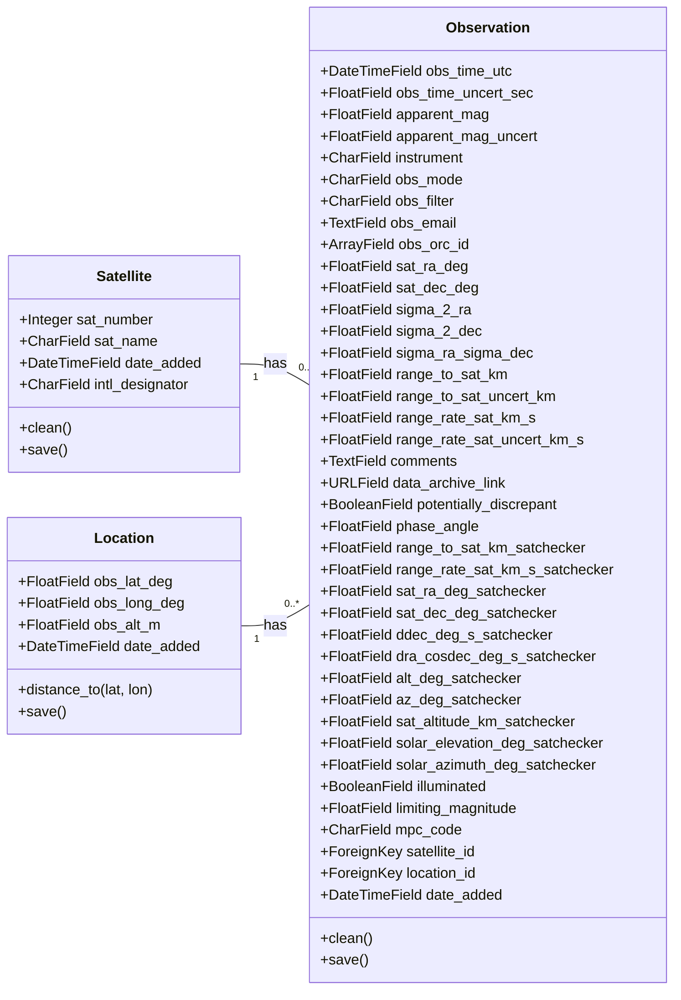

# SCORE Models

```mermaid
classDiagram
    direction LR
    class Satellite {
        +Integer sat_number
        +CharField sat_name
        +DateTimeField date_added
        +CharField intl_designator
        +clean()
        +save()
    }
    class Location {
        +FloatField obs_lat_deg
        +FloatField obs_long_deg
        +FloatField obs_alt_m
        +DateTimeField date_added
        +distance_to(lat, lon)
        +save()
    }
    class Observation {
        +DateTimeField obs_time_utc
        +FloatField obs_time_uncert_sec
        +FloatField apparent_mag
        +FloatField apparent_mag_uncert
        +CharField instrument
        +CharField obs_mode
        +CharField obs_filter
        +TextField obs_email
        +ArrayField obs_orc_id
        +FloatField sat_ra_deg
        +FloatField sat_dec_deg
        +FloatField sigma_2_ra
        +FloatField sigma_2_dec
        +FloatField sigma_ra_sigma_dec
        +FloatField range_to_sat_km
        +FloatField range_to_sat_uncert_km
        +FloatField range_rate_sat_km_s
        +FloatField range_rate_sat_uncert_km_s
        +TextField comments
        +URLField data_archive_link
        +BooleanField potentially_discrepant
        +FloatField phase_angle
        +FloatField range_to_sat_km_satchecker
        +FloatField range_rate_sat_km_s_satchecker
        +FloatField sat_ra_deg_satchecker
        +FloatField sat_dec_deg_satchecker
        +FloatField ddec_deg_s_satchecker
        +FloatField dra_cosdec_deg_s_satchecker
        +FloatField alt_deg_satchecker
        +FloatField az_deg_satchecker
        +FloatField sat_altitude_km_satchecker
        +FloatField solar_elevation_deg_satchecker
        +FloatField solar_azimuth_deg_satchecker
        +BooleanField illuminated
        +FloatField limiting_magnitude
        +CharField mpc_code
        +ForeignKey satellite_id
        +ForeignKey location_id
        +DateTimeField date_added
        +clean()
        +save()
    }
    Satellite "1" -- "0..*" Observation : has
    Location "1" -- "0..*" Observation : has
```
