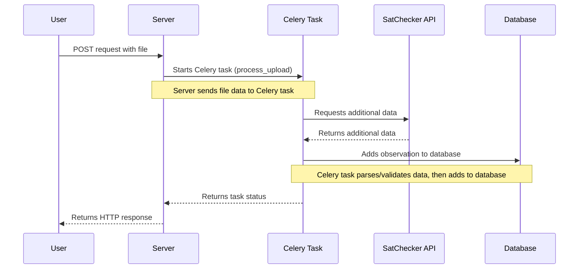

# Upload Sequence

```mermaid
sequenceDiagram
    participant User as User
    participant Server as Server
    participant Celery as Celery Task
    participant API as SatChecker API
    participant DB as Database

    User->>Server: POST request with file
    Server->>Celery: Starts Celery task (process_upload)
    Note over Server,Celery: Server sends file data to Celery task
    Celery->>API: Requests additional data
    API-->>Celery: Returns additional data
    Celery->>DB: Adds observation to database
    Note over Celery,DB: Celery task parses/validates data, then adds to database
    Celery-->>Server: Returns task status
    Server-->>User: Returns HTTP response
```
