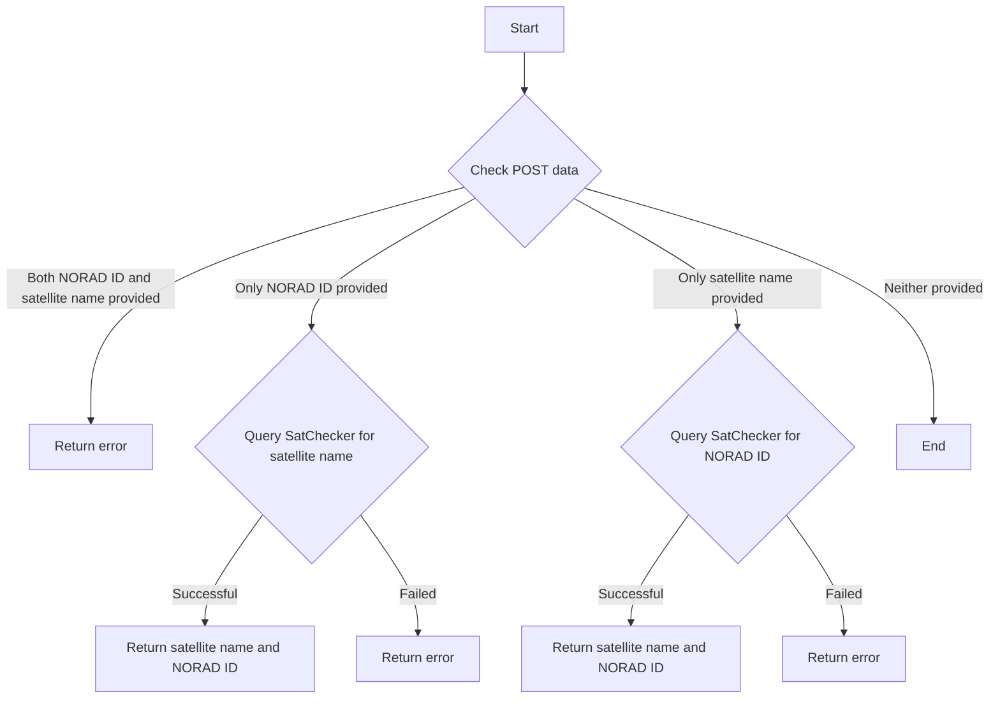
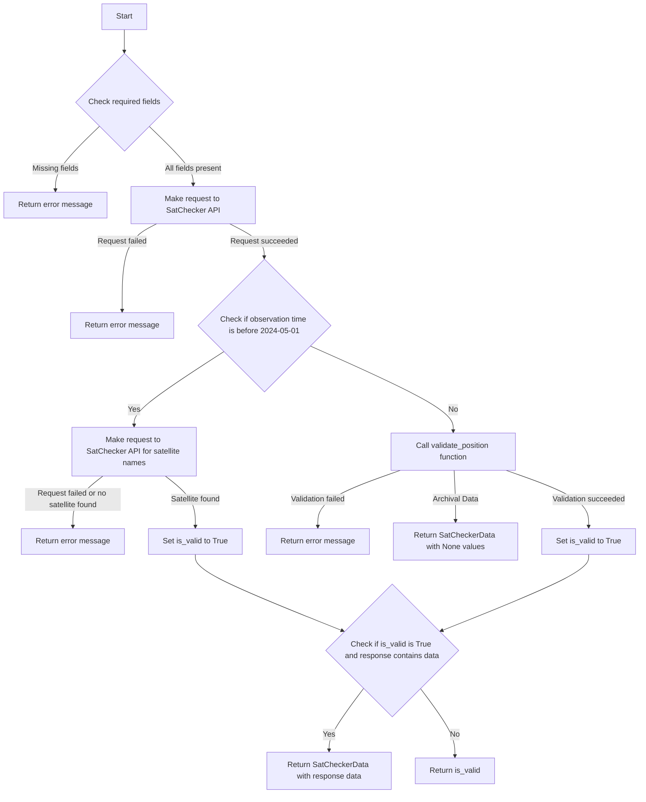

# Satellite Name/ID Check Tool

```mermaid
graph TB
    A[Start] --> B{Check POST data}
    B -->|Both NORAD ID and satellite name provided| C[Return error]
    B -->|Only NORAD ID provided| D{Query SatChecker for satellite name}
    D -->|Successful| E[Return satellite name and NORAD ID]
    D -->|Failed| F[Return error]
    B -->|Only satellite name provided| G{Query SatChecker for NORAD ID}
    G -->|Successful| H[Return satellite name and NORAD ID]
    G -->|Failed| I[Return error]
    B -->|Neither provided| J[End]
```

# Add Additional Data - Position Validation

```mermaid
graph TB
    A[Start] --> B{Check required fields}
    B -->|Missing fields| C[Return error message]
    B -->|All fields present| D[Make request to SatChecker API]
    D -->|Request failed| E[Return error message]
    D -->|Request succeeded| F{Check if observation time is before 2024-05-01}
    F -->|Yes| G[Make request to SatChecker API for satellite names]
    G -->|Request failed or no satellite found| H[Return error message]
    G -->|Satellite found| I[Set is_valid to True]
    F -->|No| J[Call validate_position function]
    J -->|Validation failed| K[Return error message]
    J -->|Archival Data| P[ Return SatCheckerData with None values]
    J -->|Validation succeeded| L[Set is_valid to True]
    I --> M{Check if is_valid is True and response contains data}
    M -->|Yes| N[Return SatCheckerData with response data]
    M -->|No| O[Return is_valid]
    L --> M
```
