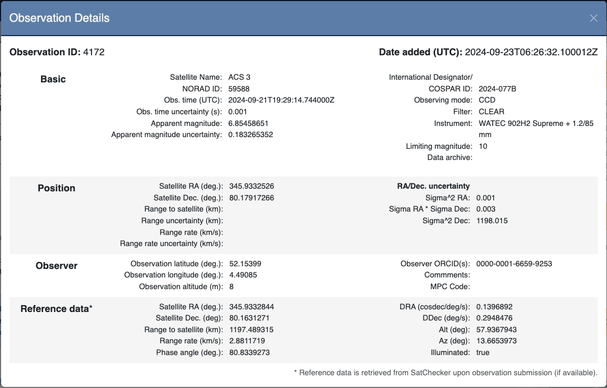
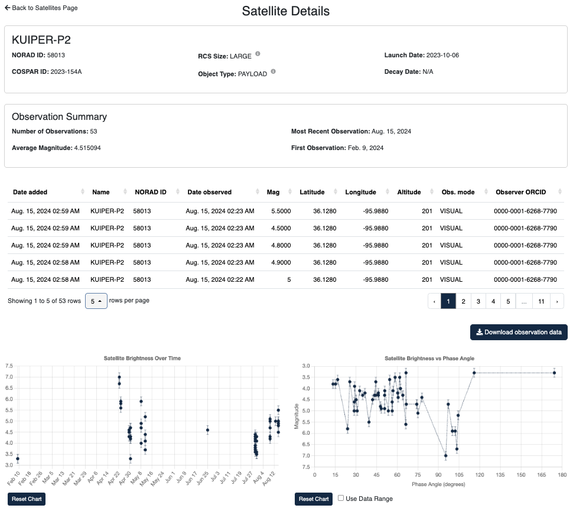

# Summary

The Satellite Constellation Observation Repository (SCORE) is a specialized data repository designed to collect and store satellite brightness and position measurements, facilitating their analysis to study the effects of satellite constellations on astronomical observations. SCORE addresses the increasing impact of satellite constellations on astronomy by providing a centralized platform where researchers, observers, and satellite operators can access and contribute to a comprehensive dataset of optical satellite observations. SCORE is developed by the International Astronomical Union's Centre for the Protection of the Dark and Quiet Sky from Satellite Constellation Interference (IAU CPS) SatHub group, with support from NSF NOIRLab. SatHub is a group within the IAU CPS that focuses on satellite observation campaigns, tools to mitigate the impact of satellite constellations on astronomy, and coordinating efforts for those topics [@sathub_summary].

SCORE uses a standardized data format that ensures consistency across all uploaded information, including required and optional fields, uniform units, and UTC time as the standard. It also integrates with `SatChecker` [@satchecker] to verify that the reported satellite positions are above the horizon at the specified observation date, time, and location. This verification process ensures the accuracy and reliability of the data stored in SCORE. Position data retrieved from SatChecker is stored alongside submitted observations, providing a complete record of the satellite's position at the time of observation.

In addition to providing the full dataset for download, SCORE offers a user-friendly web interface that allows users to search, filter, and visualize data. Users can view data aggregated by individual satellites, including basic plots of magnitude over time and magnitude vs. phase angle.

# Organization

The data format for satellite observations can be viewed here: [http://score.cps.iau.org/data-format](http://score.cps.iau.org/data-format). The data format includes fields such as satellite name, observation date and time, observer location, satellite brightness, and satellite position and velocity (if available). The data format also specifies the units for each field, ensuring consistency across all uploaded observations. All observations are vetted against this format during upload, and users will be informed of any specific errors that need to be corrected before the data can be accepted.

SCORE has a few tools to help users with uploading observations. These include a webform that generates an observation file in CSV format, a satellite position checker, a name/NORAD ID lookup tool, and an example script that creates a SCORE-compatible observation file using a Pandas DataFrame.

SCORE is a Django/Bootstrap web application with PostgreSQL as the database backend. File uploads are handled by Celery tasks, and additional functionality is supported by JavaScript and third-party libraries such as Charts.js.

# Statement of need

The number of satellites in low Earth orbit has been rapidly increasing, and this trend is expected to continue.  These satellites are bright enough to interfere with astronomical observations (both optical and radio), but the full extent of their impact needs to be quantified through actual observations at different times and altitudes in the sky. Researchers have already been collecting satellite observations and conducting `photometric surveys` [@steward_LEO_survey], but each data set has been self-contained , and not easily comparable to others. Observation campaigns organized by SatHub (part of the IAU CPS) such as the one for `BlueWalker 3` [@bluewalker3] have been collecting data on satellite brightness (and position when available) to support the publication of analysis results. However, until now, there has not been a central, public location where this data could be easily accessed for analysis. While `Trailblazer` [@trailblazer] serves as a repository for images affected by satellite trails, it currently only accepts images and is limited to specific telescopes and instruments.

As the number of satellites and satellite observations continue to grow, it is essential to have a resource that can provide an extensive dataset to support:

* Analyzing trends - providing valuable insights into the evolving impact of satellite constellations on the night sky
* Comparing observed satellite brightness and positions to predicted values and models - helping refine and validate satellite tracking and brightness prediction algorithms
* Simulating satellite constellation interference on different scientific programs, such as the Rubin Observatory's Legacy Survey of Space and Time (LSST) and observations of near-Earth objects (NEOs)
* Characterizing satellite constellations over time
* Verifying the effectiveness of brightness mitigation efforts by satellite operators and comparing satellite brightness to recommended guidelines.

Observers working with SatHub/IAU CPS are actively collecting satellite observation data and have begun submitting it to SCORE. An example of the observation data for a single observation is shown in Figure 1 (\autoref{fig:observation_info}), and an example of a page showing an overview for a single satellite is shown in Figure 2 (\autoref{fig:satellite_info}).

By serving as a central repository for satellite observations, similar to how the Minor Planet Center serves for minor planets and comets, SCORE will provide a crucial resource for investigating the evolving impact of satellite constellations as they grow and change in the future.

# Figures

# Acknowledgements
This project is supported by the IAU Centre for the Protection of the Dark and Quiet Sky from Satellite Constellation Interference (CPS) and NSF NOIRLab.

We are also very grateful to our alpha testers for their feedback and suggestions, as well as getting SCORE started with initial observations: Anthony Mallama, Brad Young, Harry Krantz, and Marco Langbroek.

# References
